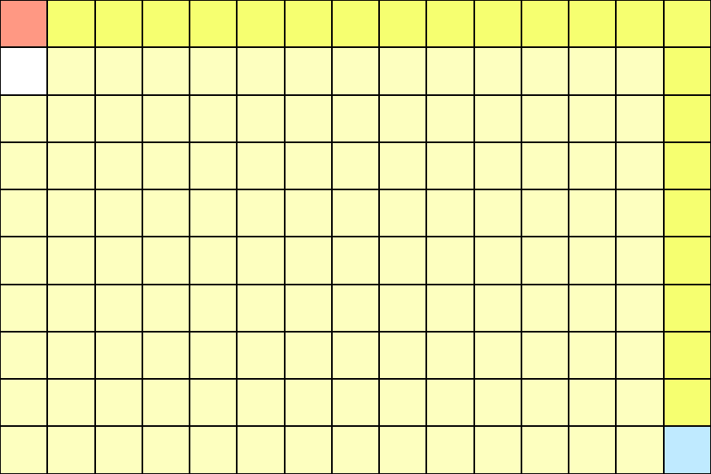
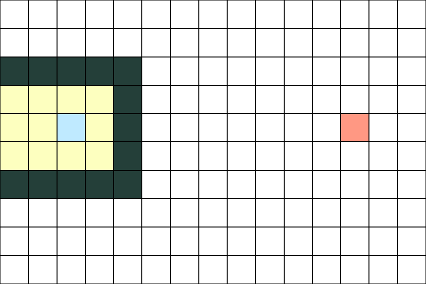

# Dijkstra-Visualizer🏴

A Dijkstra Algorithm visualizer built with pure JS. This project was meant to be a study case of the dijkstra algorithm, but throughout it's development, 
I was able to learn a lot about the importance of a design pattern, code modularity, and the difficulties of translating abstract, logical concepts such 
as nodes into user-friendly, visible and interactable components. This was one of my first serious efforts in web-development as it pushed me 
towards being a better problem solver.

## Instructions📜

1) To run the app, simply download the files or clone the repo and access the index.html file.
2) To "draw" on the grid, use the buttons on the header of the page to apply which functionality is needed to be employed.
3) Left click the squares you wish to fill and click on the "visualize algorithm" button.
   
Obs: Both a start and end node must be set in order to boot the visualization.

## Preview🏴

The nodes are represented by the squares on the grid, each color has a different meaning to the algorithm as per the caption:

It is possible to set starting, ending and blocked notes.

  
  

Impossible setups results in no path traced as per the last example.

  
  

## Takeaway🚩

While being a fairly hard project to build in my experience, it was a fun one at that. Getting to build this application was a step into finding greater 
confidency into front end development. Even though I've had considerable success in this design, there's serious efficiency problems in regards to rendering
the nodes, this is due to the grid method that i applied. This substentially decreases the page's performance and causes the algorithm to execute slowly, as it
runs synchronously with the map renderer. This could be solved via many ways, using a canvas pixelated approach, asynchronous rendering and logic(though this
solution would not be ideal), avoiding rendering the whole grid on each iteration, etc. I've decided upon remaking the project using the powerful tools from 
Angular framework, and developed a new enhanced version at <a href="https://github.com/MiguelFirmino/pathfinding-visualizer">Pathfinding Visualizer</a>.
